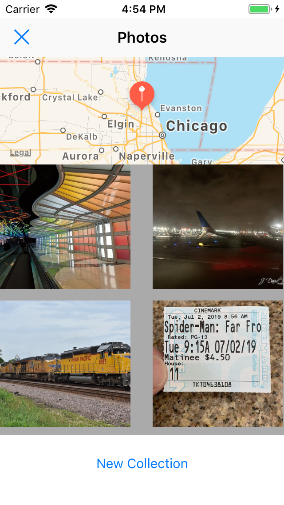

## Virtual-Tourist

### Description

A IOS app that will save geo-based Flickr pictures to your device using core-data.

	
  	
  	
  	

### Architecture

#### MapViewController

The user can select a location on a map using a long press gesture anywhere on the map. A gray annotation will drop during this time while a get request begins to receive picture information relating to the pin. Based on the response, pin color will change; green pin indicate images exist for that location; red pin no images exist. If the request times-out the pin stays gray. Gray pins will not be saved, but the request triggers again if pressed. Green and red pins are saved with core-data as Pin entity with related photo information built into url and as Photo entity with a one to many relations. "One pin has many photos". When a green pin is tapped, a segue will present the PhotoAlbumViewController passing along the Pin entity. Pins can be deleted by the "edit pin" bar button setting edit mode in the viewcontroller apron pin taps.

#### PhotoAlbumViewController

When the view first loads, management of collection cells begins. This includes how many cells to load and what picture is loaded to cell. The viewDidLoad will extract all photos related to the Pin entity that was passed during the segue. Each Photo entity contains a url, the url is then appended to a class list called "urlList". The list is used to build the amount of cells and each cell is matched to a url used to download the image. These asynchronous images will load at different times replacing placeholder image. A high timeout is set for users with slow connections, around 20 images seemed appropriate after testing. Each image is saved as binary to the photo entity by the url used in the request. When  a user taps on a cell, the image is first deleted from core-data followed by the cell, and then remove from the "urllist" data source. A user can exit from the segue by tapping the X or MKmapView at the top of the view. A new collection of pictures is retrieved by tapping the bottom button. These new pictures relate to the same pin entity, preventing mismatch of entities. 

### Saving Images

#### Entities

Note: One Pin has many Photo's

##### Pin

Latitude -> Double

Longitude -> Double

MaxPage -> 32Int

PinColor -> String

url -> URL

##### Photo

image -> Binary data

photoUrl -> URL

pinUrl -> URL

### Potential problems and improvements

improvements could be made to how data is retrieved and save as the same lines are reused. Bugs do within the pin colors when the network is intermitted. I couldn't simulate the problem even with a network conditioner.
